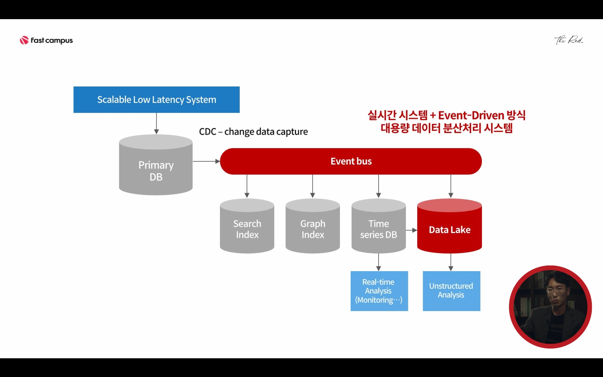

## Best practice
### 실시간 시스템 + Event-Driven 방식 대용량 데이터 분산 처리 시스템
- Scalable Low Latency System : Node.js (빠른 응답속도의 확장 가능성 높은 시스템)
- Primary DB - RDBMS (MySQL, 안정적이고 높은 정합성의 RDBMS)
- CDC : change data capture solution (이벤트 버스) - binlog listener, Linkedin's DataBus, Redis
- Search Index, Graph Index, Time series DB, Data Lake
- Search Index : Elastic Search
- Graph Index : Titan  
- Time series DB : Real-time Analysis(모니터링 등..) - InfluxDB
- Data Lake : 비정형화Unstrictured 데이터 분석을 위해 - Spark, Hadoop

> Primary DB 의 데이터 변화를 감지하여, 여러 목적성의 데이터 베이스에 데이터를 인덱싱 해둔다
> 해당 목적을 충실히 이행할 수 있는 각각의 DB에서 데이터를 빠르게 처리할 수 있다.

